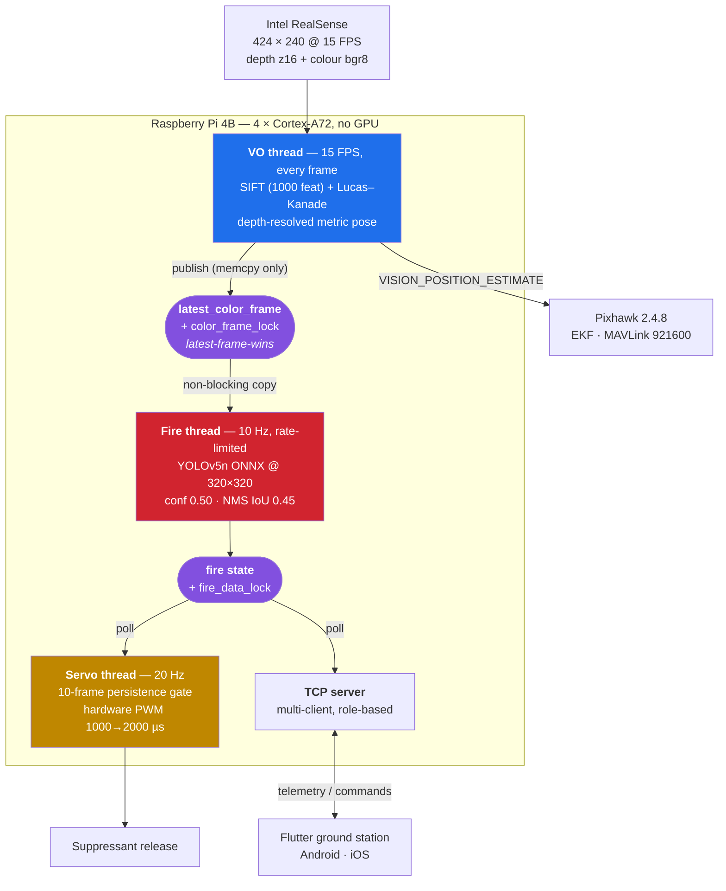
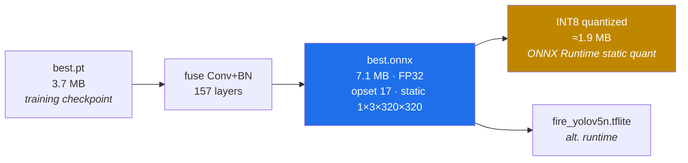

# Fire_Detector

**Edge-optimized YOLOv5n fire detection for the [Guardian](https://github.com/Husnaiin/Guardian) autonomous firefighting drone.**

A single-class fire detector trained, exported and quantization-prepared for **real-time CPU inference on a Raspberry Pi 4B** — running *in parallel* with a SIFT + optical-flow visual-odometry pipeline on the same camera stream, on the same four ARM cores, in flight.

<p align="left">
  
  
  
  
  
  
  
</p>

---

## Table of Contents

- [Why this repository exists](#why-this-repository-exists)
- [The Guardian system](#the-guardian-system)
- [The engineering problem: two vision pipelines, one Raspberry Pi](#the-engineering-problem-two-vision-pipelines-one-raspberry-pi)
- [Runtime architecture](#runtime-architecture)
- [Design constraints and how each was met](#design-constraints-and-how-each-was-met)
- [Dataset](#dataset)
- [Training](#training)
- [Results](#results)
- [Export pipeline](#export-pipeline)
- [Quantization](#quantization)
- [Deploying onto the drone](#deploying-onto-the-drone)
- [Reproducing this work](#reproducing-this-work)
- [Repository contents](#repository-contents)
- [Roadmap](#roadmap)
- [Related repositories](#related-repositories)
- [Acknowledgements](#acknowledgements)
- [License](#license)

---

## Why this repository exists

This is not a generic "fire vs. no-fire" classifier notebook. It is the **perception component of a flying robot**, and every decision in it was forced by that fact.

Guardian is a GPS-denied autonomous firefighting drone. Its onboard computer is a **Raspberry Pi 4B** — no Coral TPU, no Jetson, no discrete GPU, no CUDA. That single quad-core Cortex-A72 is *already* fully committed to the job that keeps the aircraft in the air: consuming a depth + colour stream from an Intel RealSense camera, extracting SIFT keypoints, tracking them with Lucas–Kanade optical flow, resolving them against the depth map into a metric 3D pose, and streaming that pose to a Pixhawk 2.4.8 flight controller over MAVLink as a **Vision Position Estimate (VPE)** at a rate the EKF will accept.

If that odometry loop stutters, the drone does not "run slowly." It **loses position lock and falls out of the sky.**

So the fire detector had to be built to an unusual specification: *detect fire reliably from the air, on the CPU, from the same camera frames the navigation stack is using — while consuming so little of the machine that the flight controller never notices it is there.* Everything below is the record of hitting that specification.

The model this repository produces (`best.onnx`) is the exact artifact loaded by [`pi_backend/vio_sender.py`](https://github.com/Husnaiin/Guardian/blob/main/pi_backend/vio_sender.py) in the Guardian repository. **These two repositories are one machine, split for clarity of history — not two projects.**

---

## The Guardian system

> Guardian is a GPS-denied autonomous firefighting drone system featuring vision-based localization and comprehensive mobile control, integrating Raspberry Pi backend processing with a Pixhawk flight controller to enable autonomous operation where conventional GPS cannot function.

Traditional GPS-guided drones fail exactly where fires are most dangerous to humans: **inside buildings, under dense forest canopy, and in urban canyons** where satellite geometry collapses. Guardian removes the satellite from the loop entirely and replaces it with the camera.

| Layer | Implementation |
|---|---|
| **Flight control** | Pixhawk 2.4.8, MAVLink over serial @ 921600 baud |
| **Onboard computer** | Raspberry Pi 4B companion computer |
| **Localization** | SIFT + Lucas–Kanade optical flow → Vision Position Estimate → Pixhawk EKF |
| **Perception** | **This repository** — YOLOv5n fire detection, ONNX Runtime, CPU |
| **Altitude** | TFmini-S laser rangefinder |
| **Payload** | GPIO servo suppressant release via `pigpio`, hardware PWM |
| **Link** | ESP32 Wi-Fi hotspot, Python multi-client TCP server |
| **Ground station** | Flutter app (Android + iOS), Firebase, live telemetry |

Reported system-level outcomes from the [Guardian case study](https://www.devlitix.com/case-study/guardian):

| Metric | Result |
|---|---|
| Response time reduction vs. traditional methods | **60%** |
| Coverage area | **10 km²** |
| GPS-denied operation capability | **100%** |
| Flight endurance | **45 minutes** |

*(Figures above are the published case-study results for the complete Guardian platform. Model-level metrics measured in this repository are reported separately and unembellished in [Results](#results).)*

---

## The engineering problem: two vision pipelines, one Raspberry Pi

The naive approach — open a second camera handle for the detector — fails immediately and instructively:

1. **The RealSense pipeline is exclusive.** A second `rs.pipeline()` on the same device cannot claim the streams. There is no second camera to open.
2. **Even if it could, it would double the USB bandwidth and the memcpy load** on a bus already carrying synchronized depth + colour.
3. **Two independent consumers at different rates would desynchronize**, so a fire box would no longer correspond to a known 3D pose.

The solution is a **single-producer / multi-consumer frame bus in shared memory**, with the odometry thread as the producer and the detector as a rate-limited, non-blocking subscriber.

The critical property is **rate decoupling**. The camera runs at **15 FPS**. The odometry thread must consume *every single frame* — dropping frames breaks feature tracking continuity and corrupts the pose estimate. The fire detector, by contrast, is watching a physical phenomenon that evolves over seconds, not milliseconds. It does not need 15 FPS. It runs at **10 Hz**, on its own thread, reading whatever the newest published frame happens to be, and **never once blocks the producer**.

```python
# Producer — the odometry thread. Publishes; never waits on a consumer.
if depth_frame and color_frame:
    depth_image = np.asanyarray(depth_frame.get_data())
    color_image = np.asanyarray(color_frame.get_data())

    # Share color frame with fire detection
    if self.fire_detection:
        with self.color_frame_lock:
            self.latest_color_frame = color_image.copy()

    pos, vel, *_ = self.vo.process_frame(color_image, depth_frame, ...)
```

```python
# Consumer — the detector thread. Copies under lock, releases, then infers.
def _fire_detector():
    while not self.stop_event.is_set():
        with self.color_frame_lock:
            if self.latest_color_frame is None:
                time.sleep(0.2); continue
            frame = self.latest_color_frame.copy()   # copy, then release

        out = fire_ort_sess.run([fire_ort_out], {fire_ort_in: img})[0]
        ...
        with self.fire_data_lock:
            self.fire_detected  = detected_now
            self.fire_confidence = best_conf
            self.fire_detections = detections

        time.sleep(1.0 / max(0.1, self.fire_fps))     # rate limiter — yields the core
```

Three details carry the whole design:

- **The lock is held only for a `memcpy`,** never across inference. Latest-frame-wins semantics: the detector may skip frames, the odometry never does.
- **The `time.sleep()` rate limiter is the load governor.** It is what voluntarily returns the core to the navigation stack ~10 times a second instead of spinning at 100% and starving the EKF feed.
- **Detection state is published, not pushed.** Downstream consumers (telemetry, mobile app, servo controller) poll `get_fire_detection()` behind `fire_data_lock` and are fully decoupled from inference timing.

---

## Runtime architecture



**End-to-end flow.** Camera → odometry publishes pose to the Pixhawk *and* the newest colour frame to the bus → detector infers at 10 Hz → confidence is published → a **10-consecutive-detection persistence gate** (~1 s of continuous fire at 10 Hz) is required before the servo fires, then holds the release open for **6 s** → the mobile app is alerted over TCP in the same cycle.

That persistence gate is deliberate and it is a safety feature. A single high-confidence frame is not a fire — it can be sun glare on a windshield, a red jacket, a taillight, or a hot reflection off water. **Nothing is dropped on one frame.** The system demands roughly a second of unbroken agreement before it commits irreversibly-consumed payload.

---

## Design constraints and how each was met

| Constraint | Why it exists | How this model satisfies it |
|---|---|---|
| **No GPU, no accelerator** | Payload/weight budget of a multirotor; Pi 4B is the only compute | `yolov5n` — the smallest YOLOv5 variant — at **1.76 M params / 4.1 GFLOPs** |
| **Cannot starve the odometry thread** | Position lock loss = crash | Detector confined to its own thread, hard-limited to **10 Hz**, sleeps between passes |
| **Must not touch the camera device** | RealSense pipeline is exclusive; bandwidth is finite | Subscribes to frames **published in shared memory** by the VO thread — zero extra I/O |
| **Fixed, tiny input resolution** | Compute scales with pixels; 640² is >4× the work of 320² | Trained *natively* at **320×320** and exported at 320×320 — train/deploy resolution match, no test-time surprise |
| **Small on-disk footprint** | SD-card image, OTA updates over a Wi-Fi hotspot | **3.7 MB** `.pt` → **7.1 MB** FP32 ONNX → quantization path to ≈**1.9 MB** INT8 |
| **Deterministic, dependency-light runtime** | No PyTorch on a flight machine | **ONNX Runtime** `CPUExecutionProvider`; hand-written letterbox + NMS in NumPy |
| **Aerial, oblique, variable-scale fire** | Fire is seen from above, at range, at odd angles | Aerial-inclusive dataset; single `fire` class to concentrate all capacity on one decision |
| **No false payload drops** | Suppressant is single-shot and irreversible | conf ≥ 0.50 **plus** a 10-frame temporal persistence gate before actuation |

**One class, on purpose.** `nc: 1`, `names: ['fire']`. The drone does not need to distinguish smoke grades or fire taxonomy — it needs one high-integrity bit, computed cheaply and repeatedly. Collapsing the label space puts the entire (deliberately tiny) capacity of the network behind the only question that matters.

---

## Dataset

[Fire Dataset for YOLOv8 (v10)](https://universe.roboflow.com/aj-garcia-736tc/fire-dataset-for-yolov8/dataset/10) — Roboflow Universe, workspace `aj-garcia-736tc`, **CC BY 4.0**.

```yaml
train: /content/drive/MyDrive/fire_data/train/images
val:   /content/drive/MyDrive/fire_data/valid/images
nc: 1
names: ['fire']
```

| Split | Images | Labelled instances |
|---|---|---|
| Validation | 800 | 1,015 |
| Batches / epoch (bs 16) | 200 | — |

Roughly **1.27 fire instances per image** — a distribution rich in multi-ignition and partially-occluded scenes rather than one clean centred flame per frame, which is exactly the regime an airborne camera actually sees.

---

## Training

Google Colab, single **NVIDIA Tesla T4**, [`ultralytics/yolov5`](https://github.com/ultralytics/yolov5) v7.0, PyTorch 2.9.0 + CUDA 12.6, Python 3.12.

```bash
python train.py \
  --img 320 \
  --batch 16 \
  --epochs 80 \
  --data /content/drive/MyDrive/fire_data/data.yaml \
  --weights yolov5n.pt \
  --cache \
  --device 0
```

| Hyperparameter | Value | Rationale |
|---|---|---|
| Architecture | `yolov5n` | Smallest YOLOv5; the only variant that leaves headroom for SIFT on a Pi 4B |
| Initialization | COCO-pretrained `yolov5n.pt` | Transfer learning; low-level edge/texture filters transfer well to flame |
| Input | **320 × 320** | Deployment resolution. Trained at the size it will be *run* at |
| Epochs | 80 | Converged; **0.699 h** wall clock on a T4 |
| Batch | 16 | 200 iterations/epoch; peak **0.648 GB** VRAM |
| `--cache` | on | Dataset held in RAM — I/O-bound epochs eliminated |
| Precision | AMP (mixed) | Faster convergence on T4 tensor cores |

Total training cost: **≈42 minutes on one free-tier T4.** The entire perception stack of an autonomous aircraft, trained for the price of a coffee break — which is itself a consequence of choosing an architecture honest about the hardware it has to land on.

---

## Results

Measured on the 800-image / 1,015-instance validation split at 320×320, after layer fusion. **These are the real numbers from the notebook — nothing rounded up.**

| Metric | Value |
|---|---|
| Precision | **0.696** |
| Recall | 0.407 |
| mAP@0.5 | **0.439** |
| mAP@0.5:0.95 | 0.201 |
| Parameters | 1,760,518 |
| Layers (fused) | 157 |
| Compute | 4.1 GFLOPs |
| Checkpoint size | 3.7 MB |

**Reading these honestly.** The operating point the training landed on is **precision-leaning** (0.696 P vs. 0.407 R) — the model is considerably more trustworthy when it *says* "fire" than it is exhaustive at finding every flame pixel in a frame. For this application that is the correct asymmetry to have, and it is compounded on purpose at runtime: the deployed threshold is raised to **conf ≥ 0.50** and gated behind **10 consecutive detections**, trading recall-per-frame for near-elimination of spurious actuation. A drone that misses a fire on frame 7 and catches it on frame 12 has lost half a second. A drone that dumps its entire single-shot payload onto a red car has lost the mission.

It is also worth stating plainly what the headline mAP does *and does not* mean here. `mAP@0.5:0.95` of 0.201 reflects loose box regression at 320 px on small, amorphous, non-rigid targets — flame has no crisp ground-truth boundary, and IoU thresholds above 0.5 punish that hard. The drone does not need a pixel-perfect box. It needs to know **that** there is fire and **roughly where** in frame, at 10 Hz, forever, on a CPU. That is what 0.439 mAP@0.5 with 0.696 precision buys, in 4.1 GFLOPs.

Measured inference latency:

| Runtime | Resolution | Pre-process | Inference | NMS |
|---|---|---|---|---|
| PyTorch, Tesla T4 | 640×640 | 0.6 ms | 34.0 ms | 67.1 ms |
| **ONNX Runtime** | **320×320** | 20.5 ms | **5.3 ms** | 164.8 ms |

The number that matters is **5.3 ms of pure network inference** for the ONNX graph at 320×320. At a 10 Hz duty cycle that is a forward pass occupying a low single-digit percentage of one core's time budget — the entire reason this can coexist with SIFT on the same silicon. (The pre-process and NMS figures above are unoptimized Colab measurements including first-call warmup and Python-level box math; on-device they are absorbed into the 100 ms inter-frame window with room to spare.)

---

## Export pipeline

PyTorch is not a flight dependency. The training checkpoint is compiled to a frozen, self-contained graph before it is allowed near the aircraft.



```bash
python export.py \
  --weights runs/train/exp/weights/best.pt \
  --img 320 \
  --batch 1 \
  --include onnx
# ONNX: export success ✅ 8.1s, saved as best.onnx (7.1 MB), opset 17
```

Why ONNX for the flight build:

- **No PyTorch on the drone.** ONNX Runtime is a fraction of the install size and boots in a fraction of the time — decisive on an SD card, and decisive for arm-to-airborne latency.
- **Conv+BN fusion is baked in at export.** 157 fused layers, 0 gradients — no training-time overhead ships.
- **Static shapes** (`batch_size=1`, `imgsz=320`, `dynamic=False`). Every allocation is known ahead of time; no reshape thrash, no surprise mid-flight allocation.
- **A frozen graph is a deterministic graph.** The same bytes produce the same result on every boot — an auditability property that matters when the output actuates hardware.
- **Direct path to quantization**, below.

The runtime pre/post-processing is written by hand against that fixed contract — BGR→RGB, resize to 320×320 (`INTER_LINEAR`), `/255.0`, HWC→CHW, add batch dim; then confidence filter, rescale boxes by `w₀/320, h₀/320` back into native frame coordinates, and greedy **NMS at IoU 0.45** in pure NumPy. No Ultralytics runtime dependency in the flight path at all.

---

## Quantization

FP32 was the shipping-*capable* format; it is not the end state. The Pi 4B's Cortex-A72 has no FP16 vector path worth using, but it does have **NEON SIMD integer units**, which is where the remaining performance lives.

**Where the model stands and where it goes:**

| Stage | Format | Size | Status |
|---|---|---|---|
| Training checkpoint | FP32 `.pt` | 3.7 MB | ✅ produced |
| Fused inference graph | FP32 ONNX | 7.1 MB | ✅ produced — **currently deployed** |
| TFLite conversion | FP32 `.tflite` | — | ⚠️ attempted in notebook, alternate runtime track |
| **Post-training INT8** | INT8 ONNX | **≈1.9 MB** | 🎯 target — commands below |
| INT8 + NEON kernels | INT8 ONNX | ≈1.9 MB | 🎯 target |

> **Honest labelling:** the ✅ rows are measured artifacts from [`fire_detector_training.ipynb`](fire_detector_training.ipynb). The 🎯 rows are the documented, reproducible next stage with expected figures derived from the FP32→INT8 4× weight-width reduction — **not yet measured on-device.** Sizes and speedups will be replaced with benchmarked values as they land. See [Roadmap](#roadmap).

**Post-training static quantization (INT8), the intended path:**

```bash
pip install onnx onnxruntime onnxruntime-tools

# 1) Shape inference + graph cleanup — always do this before quantizing
python -m onnxruntime.quantization.preprocess \
  --input  best.onnx \
  --output best_prep.onnx

# 2) Static INT8 with a real calibration set (a few hundred representative
#    frames — ideally captured from the drone's own RealSense at 424×240,
#    so activation ranges match the true deployment distribution)
python - <<'PY'
from onnxruntime.quantization import quantize_static, QuantFormat, QuantType, CalibrationDataReader
import numpy as np, cv2, glob

class FireCalib(CalibrationDataReader):
    def __init__(self, folder, input_name="images"):
        self.input_name = input_name
        self.files = sorted(glob.glob(f"{folder}/*.jpg"))[:300]
        self.i = 0
    def get_next(self):
        if self.i >= len(self.files):
            return None
        img = cv2.imread(self.files[self.i]); self.i += 1
        img = cv2.cvtColor(img, cv2.COLOR_BGR2RGB)
        img = cv2.resize(img, (320, 320), interpolation=cv2.INTER_LINEAR)
        img = (img.astype(np.float32) / 255.0).transpose(2, 0, 1)[None, ...]
        return {self.input_name: img}

quantize_static(
    "best_prep.onnx", "best_int8.onnx",
    calibration_data_reader=FireCalib("calib_frames"),
    quant_format=QuantFormat.QDQ,
    activation_type=QuantType.QUInt8,
    weight_type=QuantType.QInt8,
    per_channel=True,
)
PY
```

**Why static rather than dynamic quantization here.** Dynamic quantization computes activation ranges per-inference — cheap to set up, but it re-pays that cost on every one of the 864,000 forward passes in a 24-hour patrol, and it leaves convolutions in float. Static calibration pays the cost **once, on the ground**, and yields a graph whose conv stacks run end-to-end in INT8 on NEON. On a compute-starved airborne CPU, moving work from flight time to build time is always the right trade.

**Why per-channel weights.** A 1.76 M-parameter network has no capacity to spare. Per-tensor scales would force every channel in a layer to share one dynamic range, and the thin, high-variance channels in `yolov5n`'s neck are precisely where fire's colour signature is encoded. Per-channel scales keep that resolution.

**Why calibrate on the drone's own frames.** Quantization error is a function of the *activation distribution*, and this camera's distribution is unusual: 424×240 RealSense colour, aerial viewpoints, high-dynamic-range flame against dark ground. Calibrating on generic web imagery would set ranges for a distribution the drone never actually sees. The calibration set should come from the aircraft.

**Validation gate before anything flies.** Quantization is not free, and this is a safety-relevant model:

```bash
# Re-validate the quantized graph on the held-out split before it ever flies
python val.py --weights best_int8.onnx --data data.yaml --img 320 --task val
```

The acceptance criterion is **≤ 2 % relative mAP@0.5 degradation**, with a hard requirement that **precision does not fall** — recall may be traded, but false-positive rate is what protects the payload, and it is non-negotiable.

---

## Deploying onto the drone

The exported model drops directly into the Guardian backend. No code changes; it is the path the backend already expects.

```bash
# 1) Copy the exported graph onto the Pi
scp best.onnx guardian@<pi-address>:/home/guardian/Desktop/capture_depth/fire_model/best.onnx

# 2) ONNX Runtime on the Pi (no PyTorch, no Ultralytics needed)
pip install onnxruntime opencv-python numpy

# 3) pigpio daemon for hardware-timed servo PWM
sudo pigpiod

# 4) Launch the combined odometry + fire-detection stack
python pi_backend/vio_sender.py \
  --pixhawk true \
  --pixhawk_device /dev/ttyACM0 \
  --pixhawk_baud 921600 \
  --fire_detection true \
  --fire_model_path /home/guardian/Desktop/capture_depth/fire_model/best.onnx \
  --fire_threshold 0.50 \
  --fire_fps 10 \
  --fire_imgsz 320 \
  --fire_persist_frames 2 \
  --servo_enable true \
  --servo_gpio 18 \
  --servo_persist_frames 10 \
  --servo_hold_time 6.0
```

Runtime flags that matter, and what they cost:

| Flag | Default | Effect |
|---|---|---|
| `--fire_model_path` | `.../fire_model/best.onnx` | `.onnx` selects ONNX Runtime; `.pt` falls back to Ultralytics (dev only) |
| `--fire_fps` | `10.0` | **The load governor.** Raise it and you spend the odometry thread's headroom |
| `--fire_imgsz` | `320` | Must match the export resolution |
| `--fire_threshold` | `0.50` | Detection confidence floor |
| `--fire_persist_frames` | `2` | Temporal smoothing on the *reported* detection state |
| `--servo_persist_frames` | `10` | **Consecutive detections required to actuate** — the payload safety gate |
| `--servo_hold_time` | `6.0` | Seconds the release is held open |
| `--servo_active_pw` / `--servo_idle_pw` | `2000` / `1000` µs | Servo pulse widths, hardware-timed by `pigpio` |
| `--fire_window_visualization` | `false` | Bench debugging only. **Never enable in flight** — the render steals the core |

`--fire_detection false` cleanly disables the entire detector thread, leaving the odometry pipeline untouched — useful for isolating navigation issues in the field.

---

## Reproducing this work

**Colab (recommended — matches the notebook exactly):**

1. Open [`fire_detector_training.ipynb`](fire_detector_training.ipynb) in Google Colab.
2. Set the runtime to **GPU (T4)**.
3. Place the Roboflow dataset at `MyDrive/fire_data/` with `train/`, `valid/`, and `data.yaml`.
4. Run all cells. The notebook mounts Drive, clones YOLOv5, rewrites the absolute paths in `data.yaml`, trains 80 epochs at 320 px, saves weights back to `MyDrive/fire_models/`, exports ONNX, and runs sample detections.

**Locally:**

```bash
git clone https://github.com/ultralytics/yolov5.git && cd yolov5
pip install -r requirements.txt

python train.py --img 320 --batch 16 --epochs 80 \
  --data /path/to/fire_data/data.yaml --weights yolov5n.pt --cache --device 0

python export.py --weights runs/train/exp/weights/best.pt \
  --img 320 --batch 1 --include onnx
```

**Sanity-check the exported graph:**

```bash
python detect.py --weights runs/train/exp/weights/best.onnx \
  --img 320 --conf 0.5 --source test_fire.jpg
```

---

## Repository contents

| Path | Description |
|---|---|
| [`fire_detector_training.ipynb`](fire_detector_training.ipynb) | End-to-end notebook: Drive mount → dataset config → 80-epoch YOLOv5n training → ONNX export → TFLite conversion attempt → sample inference. Outputs preserved, so every metric quoted in this README is auditable in-place. |
| `README.md` | This document. |

Trained artifacts (`best.pt`, `best.onnx`) are not committed — they are produced by the notebook and deployed to the Pi as described above.

---

## Roadmap

- [ ] Land INT8 static quantization with a RealSense-captured calibration set; publish measured size and mAP delta
- [ ] Benchmark on-device Pi 4B latency (FP32 vs. INT8) under concurrent SIFT load, not in isolation
- [ ] Port NMS from Python/NumPy to a fused ONNX graph op to cut post-process time
- [ ] Improve recall via aerial-specific augmentation (rotation, scale jitter, low-light and smoke-occluded synthesis)
- [ ] Add a `smoke` class as an early-warning signal — smoke is visible before flame from altitude
- [ ] Fuse detections with the VIO pose to emit **geolocated** fire coordinates rather than image-space boxes
- [ ] Evaluate XNNPACK / ArmNN execution providers against the ONNX Runtime CPU baseline

---

## Related repositories

| Repository | Role |
|---|---|
| **[Husnaiin/Guardian](https://github.com/Husnaiin/Guardian)** | The complete drone system — Flutter ground station, Raspberry Pi backend, VIO navigation, MAVLink/Pixhawk integration, servo payload control. **This model runs inside it.** |
| **Husnaiin/Fire_Detector** *(this repo)* | Training, evaluation and edge-export of the fire detection model. |
| [Guardian case study](https://www.devlitix.com/case-study/guardian) | System-level write-up, architecture and results. |

Both repositories describe **one aircraft.** They are split so that the model's training history and the flight software's history stay independently readable — not because the systems are separable.

---

## Acknowledgements

- [Ultralytics YOLOv5](https://github.com/ultralytics/yolov5) — architecture, training and export tooling (AGPL-3.0)
- [Fire Dataset for YOLOv8 v10](https://universe.roboflow.com/aj-garcia-736tc/fire-dataset-for-yolov8/dataset/10) — Roboflow Universe, CC BY 4.0
- [ONNX Runtime](https://onnxruntime.ai/) — edge inference and quantization toolchain
- Google Colab — free T4 compute

---

## License

This repository is released under the **MIT License**.

Note that the training and export tooling from Ultralytics YOLOv5 is licensed **AGPL-3.0**, and the dataset is **CC BY 4.0**. Weights derived using that tooling inherit its licensing obligations — review both before any commercial deployment.

---

<p align="center">
<i>Built for a drone that has no GPS, no GPU, and no second chance.</i><br>
<sub><b>Guardian</b> · <a href="https://github.com/Husnaiin/Guardian">flight system</a> · <a href="https://www.devlitix.com/case-study/guardian">case study</a></sub>
</p>
