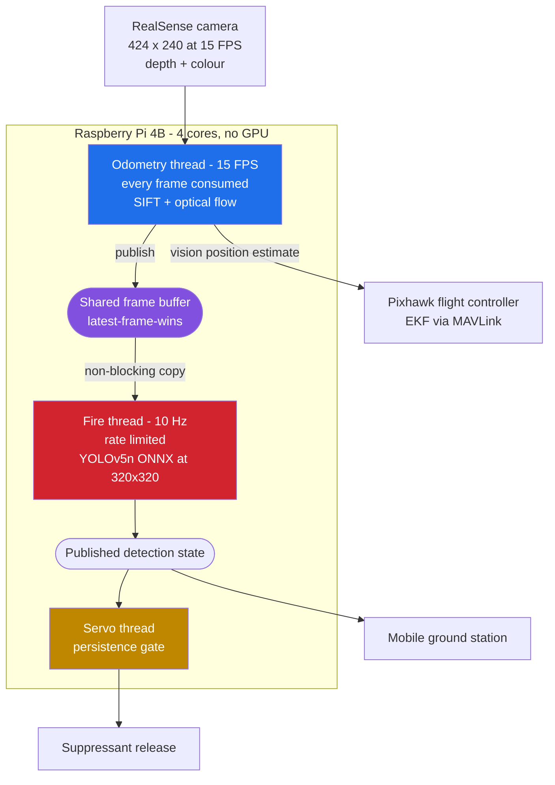

# Fire_Detector

**Edge-optimized fire detection for the [Guardian](https://github.com/Husnaiin/Guardian) autonomous firefighting drone.**

  
  
  
  
  
  
  

A single-class fire detector trained, exported and quantization-prepared for real-time CPU inference aboard a Raspberry Pi 4B — running in parallel with a visual-odometry pipeline that shares the same camera, the same four ARM cores, and the same flight.

---

## Overview

This is the perception component of a flying robot, and every decision in it was forced by that fact.

Guardian is a GPS-denied autonomous firefighting drone. Its onboard computer is a Raspberry Pi 4B — no accelerator, no discrete GPU, no CUDA. That single quad-core processor is already fully committed to the task that keeps the aircraft airborne: consuming a depth and colour stream from a RealSense camera, extracting and tracking visual features, resolving them into a metric 3D pose, and streaming that pose to a Pixhawk flight controller as a Vision Position Estimate. If that loop stutters, the drone does not run slowly — it loses position lock.

So the detector was built to an unusual specification: detect fire reliably from the air, on the CPU, from the frames the navigation stack is already consuming, while occupying so little of the machine that the flight controller never notices it is there.

The model this repository produces is the artifact loaded by the Guardian backend at launch. The two repositories describe one aircraft, split so that the model's training lineage and the flight software's lineage stay independently readable.

---

## Key characteristics

- **Nano-scale architecture.** YOLOv5n at 1.76 M parameters and 4.1 GFLOPs — the only variant that leaves headroom for feature tracking on a Pi 4B.
- **Native 320x320 training.** Trained at the resolution it is deployed at, eliminating the test-time resolution mismatch that quietly costs accuracy in most edge deployments.
- **Single class, by design.** The drone does not need a fire taxonomy. It needs one high-integrity bit, computed cheaply and repeatedly, so the entire capacity of a deliberately tiny network is concentrated behind one decision.
- **Frozen ONNX deployment.** No PyTorch and no training framework in the flight path — a static-shape graph with batch normalization folded in, executed by ONNX Runtime on CPU.
- **Frame-subscriber integration.** The detector never opens the camera. It subscribes to frames published in shared memory by the odometry thread.
- **Quantization-ready export.** The export path is structured for post-training INT8 quantization targeting the processor's NEON integer units.

---

## Runtime architecture

The naive approach — opening a second camera handle for the detector — fails immediately. The RealSense pipeline is exclusive, a second consumer would double USB bandwidth on a bus already carrying synchronized depth and colour, and two independent consumers running at different rates would desynchronize, so a detection would no longer correspond to a known pose.

The system instead uses a single-producer, multi-consumer frame bus in shared memory. The odometry thread is the producer; the detector is a rate-limited, non-blocking subscriber.

The critical property is rate decoupling. The camera runs at 15 FPS and the odometry thread must consume every single frame, because dropping one breaks feature-tracking continuity and corrupts the pose estimate. The detector is watching a physical phenomenon that evolves over seconds rather than milliseconds, so it runs at 10 Hz on its own thread, reading whatever the newest published frame happens to be, and never blocks the producer.

Three details carry the design. The shared buffer's lock is held only for a memory copy, never across inference, giving latest-frame-wins semantics in which the detector may skip frames but the odometry never does. The detector's rate limiter acts as a load governor, voluntarily returning the core to the navigation stack ten times a second rather than spinning at full occupancy. And detection state is published rather than pushed, so downstream consumers — payload control, telemetry, the mobile app — are fully decoupled from inference timing.

---

## Design constraints

| Constraint | Origin | Resolution |
|---|---|---|
| No GPU or accelerator | Multirotor payload and weight budget | YOLOv5n at 1.76 M parameters, 4.1 GFLOPs |
| Cannot starve the odometry thread | Loss of position lock is not a degraded mode | Isolated thread, hard-limited to 10 Hz |
| Cannot touch the camera device | RealSense pipeline is exclusive; bandwidth is finite | Subscribes to frames published in shared memory |
| Fixed, small input resolution | Compute scales with pixel count | Trained and exported natively at 320x320 |
| Small on-disk footprint | SD-card image, updates over a field Wi-Fi hotspot | 3.7 MB checkpoint, 7.1 MB exported graph |
| Dependency-light runtime | No training framework belongs on a flight machine | ONNX Runtime CPU execution provider |
| Aerial, oblique, variable-scale targets | Fire is seen from above, at range, at odd angles | Aerial-inclusive dataset, single-class objective |
| No false payload drops | Suppressant is single-shot and irreversible | Confidence floor plus temporal persistence gating |

---

## Dataset

[Fire Dataset for YOLOv8, version 10](https://universe.roboflow.com/aj-garcia-736tc/fire-dataset-for-yolov8/dataset/10) from Roboflow Universe, licensed CC BY 4.0. Single class, `fire`.

| Property | Value |
|---|---|
| Validation images | 800 |
| Labelled instances | 1,015 |
| Instances per image | approx. 1.27 |
| Classes | 1 |

The instance density matters more than the raw count. At roughly 1.27 fire instances per image, the distribution is rich in multi-ignition and partially-occluded scenes rather than one clean centred flame per frame — which is the regime an airborne camera actually encounters.

---

## Training

Trained on Google Colab using a single NVIDIA Tesla T4, on the Ultralytics YOLOv5 v7.0 framework.

| Parameter | Value | Rationale |
|---|---|---|
| Architecture | YOLOv5n | Smallest variant; the only one leaving headroom for feature tracking |
| Initialization | COCO-pretrained | Low-level edge and texture filters transfer well to flame |
| Input resolution | 320 x 320 | Deployment resolution — trained at the size it is run at |
| Epochs | 80 | Converged in 0.699 hours wall clock |
| Batch size | 16 | 200 iterations per epoch, 0.648 GB peak VRAM |
| Dataset caching | Enabled | Held in RAM, eliminating I/O-bound epochs |
| Precision | Mixed (AMP) | Faster convergence on tensor cores |

The full perception stack of an autonomous aircraft trained in roughly forty minutes on free-tier compute — itself a consequence of choosing an architecture honest about the hardware it has to land on.

---

## Results

Measured on the held-out validation split at 320 x 320 after layer fusion.

| Metric | Value |
|---|---|
| Precision | 0.696 |
| Recall | 0.407 |
| mAP at IoU 0.5 | 0.439 |
| mAP at IoU 0.5:0.95 | 0.201 |
| Parameters | 1,760,518 |
| Fused layers | 157 |
| Compute | 4.1 GFLOPs |
| Checkpoint size | 3.7 MB |

The operating point is precision-leaning by design. The model is considerably more trustworthy when it reports fire than it is exhaustive at finding every flame pixel, and that asymmetry is the correct one for an aircraft carrying a single-shot payload. It is compounded deliberately at runtime, where a raised confidence floor and a temporal persistence gate trade per-frame recall for near-elimination of spurious actuation. A drone that catches a fire on the twelfth frame instead of the seventh has lost half a second; a drone that empties its payload onto a red vehicle has lost the mission.

Inference latency, measured on the exported graph:

| Runtime | Resolution | Inference |
|---|---|---|
| PyTorch, Tesla T4 | 640 x 640 | 34.0 ms |
| ONNX Runtime | 320 x 320 | 5.3 ms |

The figure that governs the design is 5.3 ms of network inference at deployment resolution. At a 10 Hz duty cycle that is a forward pass occupying a low single-digit percentage of one core's time budget — the entire reason the detector can coexist with feature tracking on the same silicon.

---

## Export and quantization

The training checkpoint is compiled into a frozen, self-contained graph before it goes near the aircraft.

| Stage | Format | Size |
|---|---|---|
| Training checkpoint | FP32 PyTorch | 3.7 MB |
| Fused inference graph | FP32 ONNX, opset 17 | 7.1 MB |
| Quantization target | INT8 ONNX | approx. 1.9 MB |

Export folds batch normalization into the preceding convolutions, producing 157 fused layers with no training-time overhead shipped. Shapes are pinned static at a batch size of one and a 320 x 320 input, so every allocation is known ahead of time and there is no reshape thrash or surprise mid-flight allocation. A frozen graph is also a deterministic graph: the same bytes produce the same result on every boot, which is an auditability property that matters when the output actuates hardware.

Pre- and post-processing are written directly against that fixed contract — colour conversion, resize, normalization, channel reordering on the way in; confidence filtering, box rescaling into native frame coordinates, and non-maximum suppression on the way out — so the flight path carries no dependency on the training framework at all.

**Quantization strategy.** The Pi's processor has no floating-point vector path worth exploiting, but it does have NEON SIMD integer units, and that is where the remaining performance lives. The export path is therefore built for post-training static quantization to INT8, which narrows weights fourfold and moves the convolution stacks onto integer kernels.

Static calibration is preferred over dynamic quantization for a specific reason. Dynamic quantization computes activation ranges per inference — cheap to configure, but that cost is re-paid on every forward pass, of which a long patrol performs hundreds of thousands. Static calibration pays it once, on the ground. On a compute-starved airborne CPU, moving work from flight time to build time is always the correct trade.

Two further choices follow from the model's size. Weights are quantized per channel rather than per tensor, because a network this small has no capacity to spare and the thin, high-variance channels in the neck are precisely where flame's colour signature is encoded. And calibration data should be drawn from the drone's own camera rather than generic imagery, because quantization error is a function of the activation distribution, and this distribution is unusual — low-resolution aerial viewpoints with high-dynamic-range flame against dark ground.

Because the model actuates hardware, quantization is gated on re-validation rather than assumed lossless. The acceptance criterion is a negligible drop in mean average precision with a hard requirement that precision does not fall. Recall may be traded; the false-positive rate is what protects the payload.

---

## Repository contents

| Path | Description |
|---|---|
| `fire_detector_training.ipynb` | End-to-end notebook covering dataset configuration, training, export, and sample inference, with outputs preserved so every metric quoted here is auditable in place |
| `README.md` | This document |

Trained artifacts are not committed. They are produced by the notebook and deployed to the aircraft as described in the [Guardian](https://github.com/Husnaiin/Guardian) repository.

---

## Reproducing

Open the notebook in Google Colab with a GPU runtime, place the Roboflow dataset in the expected Drive location with its training and validation splits, and run all cells. The notebook mounts storage, retrieves the YOLOv5 framework, rewrites the dataset configuration paths, trains for 80 epochs at 320 x 320, saves the weights back to Drive, exports the ONNX graph, and runs sample detections.

The same sequence runs locally against a CUDA-capable device with the YOLOv5 framework installed.

---

## Roadmap

- Land INT8 quantization with a calibration set captured from the drone's own camera, and publish measured size and accuracy deltas
- Benchmark on-device latency under concurrent navigation load rather than in isolation
- Move non-maximum suppression into the exported graph to reduce post-processing time
- Improve recall through aerial-specific augmentation covering rotation, scale jitter, low light and smoke occlusion
- Add a smoke class as an early-warning signal, since smoke is visible before flame from altitude
- Fuse detections with the odometry pose to emit geolocated fire coordinates rather than image-space boxes
- Evaluate alternative execution providers against the ONNX Runtime CPU baseline

---

## Related repositories

| Repository | Role |
|---|---|
| [Husnaiin/Guardian](https://github.com/Husnaiin/Guardian) | The complete drone system — mobile ground station, Raspberry Pi backend, GPS-denied navigation, flight controller integration and payload control. This model runs inside it. |
| Husnaiin/Fire_Detector | This repository. Training, evaluation and edge export of the detection model. |
| [Guardian case study](https://www.devlitix.com/case-study/guardian) | System-level write-up, architecture and results |

---

## Acknowledgements

- [Ultralytics YOLOv5](https://github.com/ultralytics/yolov5) for the architecture, training and export tooling
- [Roboflow Universe](https://universe.roboflow.com/aj-garcia-736tc/fire-dataset-for-yolov8/dataset/10) for the fire dataset
- [ONNX Runtime](https://onnxruntime.ai/) for edge inference and the quantization toolchain
- Google Colab for training compute

---

## License

Released under the MIT License.

The training and export tooling from Ultralytics YOLOv5 is licensed AGPL-3.0 and the dataset is CC BY 4.0. Weights derived using that tooling inherit its licensing obligations; review both before any commercial deployment.

---

<i>Built for a drone with no GPS, no GPU, and no second chance.</i> 
<b>Guardian</b> &middot; <a href="https://github.com/Husnaiin/Guardian">flight system</a> &middot; <a href="https://www.devlitix.com/case-study/guardian">case study</a>

